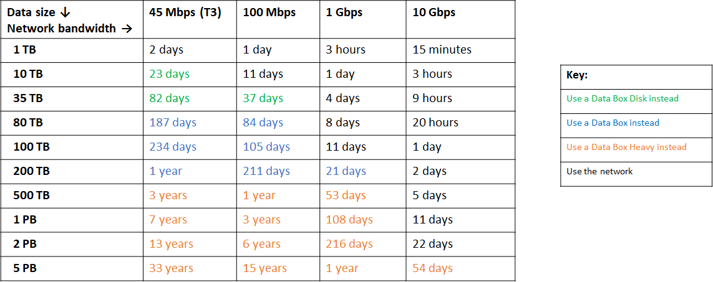
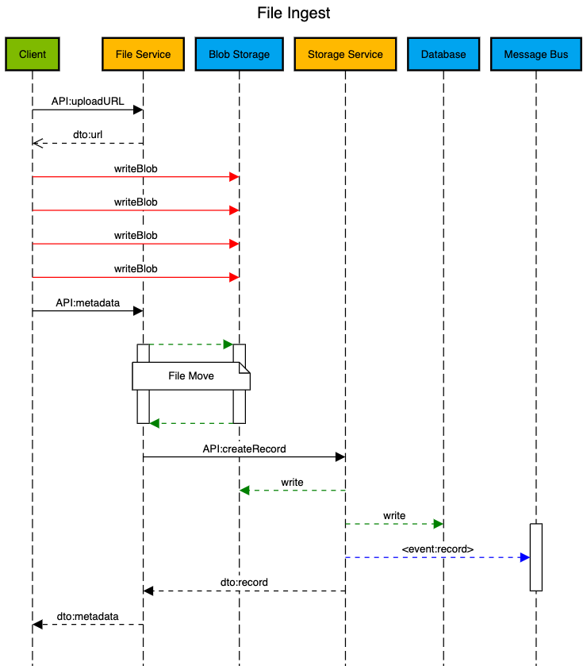
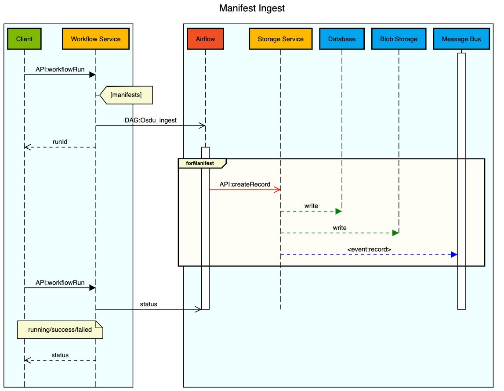

# osdu-data-load-tno


## Operations Persona

This method of loading data provides a way to load data using ARM templates. The solution leverages a cloud based container to execute a data load using data hosted in an Azure Storage Account file share. To load data follow the 2 step process.

> The ingested TNO data is OSDU<sup>TM</sup> M10 specific. If you need to load a different TNO data set (e.g. [M8](https://community.opengroup.org/osdu/platform/data-flow/data-loading/open-test-data/-/tree/Azure/M8)), you should use the [Developer Persona](#developer-persona).

__Step 1__

Deploy resources to Azure using this [ARM template](https://github.com/Azure/osdu-data-load-tno/blob/main/azuredeploy.json). Data will be downloaded from OSDU, extracted and Uploaded into a Storage Account.

[](https://portal.azure.com/#create/Microsoft.Template/uri/https%3A%2F%2Fraw.githubusercontent.com%2FAzure%2Fosdu-data-load-tno%2Fmain%2Fazuredeploy.json)

Estimated Time: 1.5 hours

__Step 2__

Load data to an OSDU instance by executing the Template Spec created by `Step 1`.

Estimated Time: 45 minutes

Required Parameters for Loading an OSDU Instance.

- OSDU Endpoint

  The URL where the OSDU API is available.
  Example: `https://myosdu.contoso.com`

- Data Partition Name

  The name of the OSDU Data Partition where data should be loaded.
  Example: `myosdu-billing`

- Viewer Group

  The ACL group to be used by the load for data read.
  Example: `data.default.viewers`

- Owner Group

  The ACL group to be used by the load for data ownership.
  Example: `data.default.owners`

- Data Domain 

  The domain of the ACL's for data ownership. (Not typically changed)
  Example: `contoso.com`

- Legal Tag

  The legal tag to be used by the load.

- Client Id

  The client id for authentication that has authorization to load data.

- Client Secret

  The client secret for authentication that has authoriztion to load data.


> Cleanup: Logs and state are persisted to the storage account file share `output` which need to be removed prior to starting additional loads.

## Developer Persona

This method of loading data is intended for engineers wishing to customize control or manually work with data loads.

This solution supports [GitHub Codespaces](https://github.com/features/codespaces) as preferred, however [VSCode Remote containers](https://code.visualstudio.com/docs/remote/containers) can be utilized assuming the host machine has enough resources allocated to Docker.  A custom container will be built with a post container build hook that will download the [open-test-data](https://community.opengroup.org/osdu/platform/data-flow/data-loading/open-test-data) from OSDU and copy files into a custom directory structure for the ingestion scripts to process. The downloaded TNO data is M10 specific, but it can be adjusted to work with other OSDU milestones (e.g. [M8](https://community.opengroup.org/osdu/platform/data-flow/data-loading/open-test-data/-/tree/Azure/M8)) by modifying the data download URL and data extraction steps in [on-create.sh](./.devcontainer/on-create.sh).

__Environment Variables__

Add environment variables to a `.envrc` file which will be auto loaded by [direnv](https://direnv.net) after execution of `direnv allow`.

```bash
export AZURE_TENANT=<your_azure_tenant>
export CLIENT_ID=<your_application_id>
export CLIENT_SECRET=<your_application_secret>
export NAME=<your_platform_name>
export DOMAIN=<your_domain_name>
export PARTITION=<your_partition_name>

export DATA_PARTITION=$NAME-$PARTITION
export OSDU_ENDPOINT=https://$NAME.$DOMAIN
export LEGAL_TAG=${DATA_PARTITION}-open-test-data
export LOGIN_ENDPOINT=https://login.microsoftonline.com/${AZURE_TENANT}/oauth2/v2.0/token
export SCOPE="$CLIENT_ID/.default openid profile offline_access"

export URL="https://login.microsoftonline.com/${AZURE_TENANT}/oauth2/v2.0/authorize?client_id=${CLIENT_ID}&response_type=code&redirect_uri=http%3a%2f%2flocalhost%3a8080&response_mode=query&scope=${CLIENT_ID}%2f.default&state=12345&sso_reload=true"

export REFRESH_TOKEN=<your_refresh_token>
```

__API access tokens__

A refresh token is used by loading scripts to request [OAuth2.0 access tokens](https://docs.microsoft.com/en-us/azure/active-directory/develop/v2-oauth2-auth-code-flow).  The following code snippet can help retrieve a valid Refresh Token once a redirect url of `http://localhost:8080` has been added to a [Web Platform Configuration](https://docs.microsoft.com/en-us/azure/active-directory/develop/quickstart-register-app#add-a-redirect-uri) on the AD Application.

Add the retrieved refresh token to the `.envrc` file and allow variables to load using `direnv allow`.

```bash
# Open the following URL in a browser
echo $URL

# Set the Response from the Browser in a Variable
RESPONSE="<your_response>"

# Get REFRESH Token and set in in the .envrc file
REFRESH_TOKEN=$(curl --silent --request POST \
  --url https://login.microsoftonline.com/${AZURE_TENANT}/oauth2/v2.0/token \
  --header "content-type: application/x-www-form-urlencoded" \
  --data "grant_type=authorization_code" \
  --data "client_id=${CLIENT_ID}" \
  --data "client_secret=${CLIENT_SECRET}" \
  --data "code=$(echo $RESPONSE | cut -d "=" -f 2 | cut -d "&" -f 1)" \
  --data "scope=$CLIENT_ID/.default openid profile offline_access" \
  --data "redirect_uri=http%3A%2F%2Flocalhost%3a8080" | jq -r .refresh_token)

echo $REFRESH_TOKEN

```

__Execute Data Load__

In a terminal window execute the following bash script. `/workspace/load.sh`

By default the entire load process will execute, but each action has an environment variable feature flag that can toggle actions off.

```bash
LOG_LEVEL=debug             # Activate Log Debug
PIP_INSTALL=false           # Disable PIP installation

CONFIGURE_INI=false         # Disable creation of the python configuration file
CHECK_LEGAL_TAG=false       # Disable Legal Tag Validation
GENERATE_MANIFEST=false     # Disable Manifest Generation
LOAD_MASTERDATA=false       # Disable Loading of Master Data
LOAD_FILES=false            # Disable File Ingestion
LOAD_WORKPRODUCTS=false     # Disable Loading of WorkProducts
```

# Open Test Data

## Statistics

Loading data and the time it to accomplish a loading process has different factors that need to be understood.

1. Client Bandwidth -- The network bandwidth between the client and the platform.
2. Client Resources -- The amount of CPU cores and memory that the client can use to process requests.
3. Client Latency -- The distance from the client to the platform.

The dataset contains files and manifests and a loading process typically takes under hour to accomplish.

__Files – 12,786__

| Count    | Type           | Format   |
| :------- |:-------------- | --------:|
| 5904     |  Markers       |      csv |
| 5944     |  Trajectories  |      csv |
| 929      |  Well Logs     |      csv |
| 9        |  Documents     |  pdf/txt |


__Manifests – 12,570__

| Count   | Manfiest Type                      |
| :------ |:---------------------------------- |
| 98      |  Reference Data                    |
| 422     |  Master Data Fields                |
| 406     |  Master Data Geopolitical Entities |
| 213     |  Master Data Organisation          |
| 4947    |  Master Data Wells                 |
| 6484    |  Master Data Wellbores             |

__Work Product Components – 12,785__

| Count   | Manfiest Type                      |
| :------ |:---------------------------------- |
| 9       |  Documents                         |
| 929     |  Well logs                         |
| 5904    |  Wellbore Marker Sets              |
| 5943    |  Wellbore Trajectories             |

__98 Reference Data Manifests are loaded__
```
Key                                                            Count
-------------------------------------------------------------  -------
osdu:wks:reference-data--AliasNameType:1.0.0                   5
osdu:wks:reference-data--CoordinateReferenceSystem:1.0.0       8
osdu:wks:reference-data--DrillingReasonType:1.0.0              16
osdu:wks:reference-data--FacilityEventType:1.0.0               3
osdu:wks:reference-data--FacilityStateType:1.0.0               10
osdu:wks:reference-data--FacilityType:1.0.0                    2
osdu:wks:reference-data--GeoPoliticalEntityType:1.0.0          6
osdu:wks:reference-data--MaterialType:1.0.0                    15
osdu:wks:reference-data--OperatingEnvironment:1.0.0            2
osdu:wks:reference-data--ResourceSecurityClassification:1.0.0  1
osdu:wks:reference-data--SchemaFormatType:1.0.0                3
osdu:wks:reference-data--UnitOfMeasure:1.0.0                   9
osdu:wks:reference-data--VerticalMeasurementPath:1.0.0         5
osdu:wks:reference-data--VerticalMeasurementType:1.0.0         10
osdu:wks:reference-data--WellboreTrajectoryType:1.0.0          3
```

__12,472 Manifests are loaded__
```
Key                                                            Count
-------------------------------------------------------------  -------
osdu:wks:master-data--Field:1.0.0                              422
osdu:wks:master-data--GeoPoliticalEntity:1.0.0                 406
osdu:wks:master-data--Organisation:1.0.0                       213
osdu:wks:master-data--Well:1.0.0                               4947
osdu:wks:master-data--Wellbore:1.0.0                           6484
```

__12,785 Work Product Components are loaded__
```
Key                                                            Count
-------------------------------------------------------------  -------
osdu:wks:work-product-component--Document:1.0.0                9
osdu:wks:work-product-component--WellLog:1.0.0                 929
osdu:wks:work-product-component--WellboreMarkerSet:1.0.0       5904
osdu:wks:work-product-component--WellboreTrajectory:1.0.0      5943

```

# Overview of File Ingestion

Loading files into the data platform using the Core API is a multi step process and involves moving files in to cloud storage.  It is important to understand the following chart which can be found in the [azure documentation](https://docs.microsoft.com/en-us/azure/storage/common/storage-solution-large-dataset-moderate-high-network?toc=%2Fazure%2Fstorage%2Fblobs%2Ftoc.json).

__Dataset transfer over moderate to high network bandwidth__



File ingestion executes the following actions in the platform.



__Retrieve a Platform Storage URL__

A file url is requested from the platform for an Azure Storage Blob with an authorized [SAS Token](https://docs.microsoft.com/en-us/azure/storage/common/storage-sas-overview#service-sas).

```bash
###
# @name uploadURL
GET {{FILE_HOST}}/files/uploadURL
Authorization: Bearer {{access_token}}
Accept: application/json
Content-Type: application/json
data-partition-id: {{DATA_PARTITION}}

@FILE_ID = {{uploadURL.response.body.FileID}}
@FILE_URL = {{uploadURL.response.body.Location.SignedURL}}
@FILE_SOURCE = {{uploadURL.response.body.Location.FileSource}}
```


__Write the data to the blob__

Data is written to the Platform using an Azure Storage Account [Put Blob Operation](https://docs.microsoft.com/en-us/rest/api/storageservices/put-blob)

```bash
###
# @name uploadFile
PUT {{FILE_URL}}
x-ms-blob-type: BlockBlob

< ./sample.las
```

__Provide MetaData to describe the Generic File__

MetaData is submitted to the File Service once the data has been written and the system then processes and indexes the ingested file.

A valid legal tag with required ACL's always occupies any piece of data and the FILE_SOURCE is a platform pointer that was obtained earlier from the URL request.

```bash
###
# @name metaData
POST {{FILE_HOST}}/files/metadata
Authorization: Bearer {{access_token}}
Accept: application/json
Content-Type: application/json
data-partition-id: {{DATA_PARTITION}}

{
    "kind": "osdu:wks:dataset--File.Generic:1.0.0",
    "acl": {
        "viewers": [
            "data.default.viewers@{{DATA_PARTITION}}.contoso.com"
        ],
        "owners": [
            "data.default.viewers@{{DATA_PARTITION}}.contoso.com"
        ]
    },
    "legal": {
        "legaltags": [
            "{{LEGAL_TAG}}"
        ],
        "otherRelevantDataCountries": [
            "US"
        ],
        "status": "compliant"
    },
    "data": {
        "ResourceSecurityClassification": "osdu:reference-data--ResourceSecurityClassification:RESTRICTED:",
        "SchemaFormatTypeID": "osdu:reference-data--SchemaFormatType:LAS2:",
        "DatasetProperties": {
            "FileSourceInfo": {
                "FileSource": "{{FILE_SOURCE}}",
                "Name": "sample.las"
            }
        },
        "Name": "sample.las"
        "Description": "well-log"
    }
}

@ID = {{metaData.response.body.id}}
```

__Record Indexing__

The ingestion of a file will always trigger a message is processed to index the data to be retrieved later by search.


## Python Script File Ingestion

A python script is used to execute data load activities and can be used to load a directory of files.

A glob filter pattern is applied to ensure only files with extensions of `pdf`, `txt`, `las`, and `csv` are loaded.

```bash
python3 src/data_load/load.py datasets --dir "some_directory" --output-file-name "file_load_results.json"
```

Since files are loaded sequentially by walking the directory structure to accelerate performance an [asynchronous execution]((https://docs.python.org/3/library/concurrent.futures.html)) is performed with a ThreadPoolExecutor.  The number of threads are  automatically calculated with the formula `5 * multiprocessing.cpu_count()` but can be overwritten using the `WORKERS` environment variable.

Blob data is written in `32 Mb` chunks but can also be adjusted using a `MAX_CHUNK_SIZE` environment variable.

The python script is configured to automatically request using a retry and backoff pattern available from the Python [Request](https://requests.readthedocs.io/en/latest/) library.

```python
retries=5,
backoff_factor=1.0,
status_forcelist=(404, 500, 502, 503, 504),
method_whitelist=["GET", "PUT", "POST", "DELETE"]
```

## Bash Script Orchestrator

To orchestrate the activities of loading files for a specific dataset a simple bash script is used which controls and sequences specific directories containing files to load as well as where the results should be written.  Keeping track of the ingested file identifiers becomes important to later load the Work Product Component manifests.


_Sample Bash Blocks_
```bash
  # File Ingest Documents
  echo "-- WPC Documents: Start" && _START="$(date +%s)"
  python3 $SCRIPT_DIR/src/data_load/load.py datasets \
    --dir $SCRIPT_DIR/open-test-data/datasets/documents \
    --output-file-name "output/loaded-documents-datasets.json"
  echo "-- WPC Documents: End  $(convertsecs $[ $(date +%s) - ${_START} ])"
```

# Overview of Manifest Ingestion

To load a manifest into the system the following actions are performed.



Manifests exist as default templates that have a generic `id` with an empty `acl` and `legal` attribute.  Below you will find a few sample manifests that can be used to help understand the format.

_Sample Alais Manifest_
```json
{
  "kind": "osdu:wks:Manifest:1.0.0",
  "ReferenceData": [
    {
      "id": "osdu:reference-data--AliasNameType:Borehole",
      "kind": "osdu:wks:reference-data--AliasNameType:1.0.0",
      "acl": {
        "owners": [],
        "viewers": []
      },
      "legal": {
        "legaltags": [],
        "otherRelevantDataCountries": []
      }
      "data": {
        "Source": "TNO",
        "Name": "Borehole",
        "Code": "Borehole"
      }
    }
  ]
}
```

_Sample Field Manifest_
```json
{
  "kind": "osdu:wks:Manifest:1.0.0",
  "MasterData": [
    {
      "id": "osdu:master-data--Field:A12-FA",
      "kind": "osdu:wks:master-data--Field:1.0.0",
      "acl": {
        "owners": [],
        "viewers": []
      },
      "legal": {
        "legaltags": [],
        "otherRelevantDataCountries": []
      },
      "data": {
        "FieldName": "A12-FA"
      }
    }
  ]
}
```

_Sample GeoPoliticalEntity Manifest_
```json
{
  "kind": "osdu:wks:Manifest:1.0.0",
  "MasterData": [
    {
      "id": "osdu:master-data--GeoPoliticalEntity:Netherlands_Country",
      "kind": "osdu:wks:master-data--GeoPoliticalEntity:1.0.0",
      "acl": {
        "owners": [],
        "viewers": []
      },
      "legal": {
        "legaltags": [],
        "otherRelevantDataCountries": []
      },
      "data": {
          "Source": "TNO",
          "GeoPoliticalEntityTypeID": "osdu:reference-data--GeoPoliticalEntityType:Country:",
          "GeoPoliticalEntityName": "Netherlands"
      }
    }
  ]
}
```

_Sample Organisation Manifest_
```json
{
  "kind": "osdu:wks:Manifest:1.0.0",
  "MasterData": [
    {
      "id": "osdu:master-data--Organisation:A%20en%20G%20van%20den%20Bosch%20B.V.",
      "kind": "osdu:wks:master-data--Organisation:1.0.0",
      "acl": {
        "owners": [],
        "viewers": []
      },
      "legal": {
        "legaltags": [],
        "otherRelevantDataCountries": []
      },
      "data": {
          "Source": "TNO",
          "OrganisationName": "A%20en%20G%20van%20den%20Bosch%20B.V."
      }
    }
  ]
}
```

> Manifests reference each other which require manifest loads to be properly sequenced to ensure dependencies exist.

_Sample Well Manifest_
```json
{
  "kind": "osdu:wks:Manifest:1.0.0",
  "MasterData": [
    {
      "id": "osdu:master-data--Well:1000",
      "kind": "osdu:wks:master-data--Well:1.0.0",
      "acl": {
        "owners": [],
        "viewers": []
      },
      "legal": {
        "legaltags": [],
        "otherRelevantDataCountries": []
      },
      "meta": [
        {
          "kind": "Unit",
          "name": "m",
          "persistableReference": "{\"abcd\":{\"a\":0.0,\"b\":1.0,\"c\":1.0,\"d\":0.0},\"symbol\":\"m\",\"baseMeasurement\":{\"ancestry\":\"L\",\"type\":\"UM\"},\"type\":\"UAD\"}",
          "unitOfMeasureID": "osdu:reference-data--UnitOfMeasure:m:",
          "propertyNames": [
            "VerticalMeasurements[].VerticalMeasurement"
          ]
        }
      ],
      "data": {
        "Source": "TNO",
          "NameAliases": [
            {
              "AliasName": "ACA-11",
              "AliasNameTypeID": "osdu:reference-data--AliasNameType:Well:"
            },
            {
              "AliasName": "1000",
              "AliasNameTypeID": "osdu:reference-data--AliasNameType:UWI:"
            }
        ],
        "GeoContexts": [
          {
            "GeoPoliticalEntityID": "osdu:master-data--GeoPoliticalEntity:Netherlands_Country:",
            "GeoTypeID": "osdu:reference-data--GeoPoliticalEntityType:Country:"
          },
          {
            "GeoPoliticalEntityID": "osdu:master-data--GeoPoliticalEntity:Limburg_Province:",
            "GeoTypeID": "osdu:reference-data--GeoPoliticalEntityType:Province:"
          },
          {
            "GeoPoliticalEntityID": "osdu:master-data--GeoPoliticalEntity:L_Quadrant:",
            "GeoTypeID": "osdu:reference-data--GeoPoliticalEntityType:Quadrant:"
          }
        ],
        "SpatialLocation": {
          "Wgs84Coordinates": {
            "type": "FeatureCollection",
            "features": [
              {
                "type": "Feature",
                "geometry": {
                  "type": "Point",
                  "coordinates": [
                    5.98136045,
                    51.43503877
                  ]
                },
                "properties": {}
              }
            ]
          }
        },
        "FacilityTypeID": "osdu:reference-data--FacilityType:Well:",
        "FacilityOperators": [
            {
                "FacilityOperatorOrganisationID": "osdu:master-data--Organisation:ROVD:"
            }
        ],
        "OperatingEnvironmentID": "osdu:reference-data--OperatingEnvironment:On:",
        "FacilityName": "ACA-11",
        "FacilityStates": [
          {
            "FacilityStateTypeID": "osdu:reference-data--FacilityStateType:Abandoned:"
          }
        ],
        "FacilityEvents": [
          {
            "FacilityEventTypeID": "osdu:reference-data--FacilityEventType:Spud:",
            "EffectiveDateTime": "1909-04-05T00:00:00"
          },
          {
            "FacilityEventTypeID": "osdu:reference-data--FacilityEventType:TDReached:",
            "EffectiveDateTime": "1910-01-19T00:00:00"
          }
        ],
        "DefaultVerticalMeasurementID": "RotaryTable",
        "VerticalMeasurements": [
          {
            "VerticalMeasurementID": "RotaryTable",
            "VerticalMeasurement": 29.3,
            "VerticalMeasurementTypeID": "osdu:reference-data--VerticalMeasurementType:RotaryTable:",
            "VerticalMeasurementPathID": "osdu:reference-data--VerticalMeasurementPath:Elevation:",
            "VerticalCRSID": "osdu:reference-data--CoordinateReferenceSystem:5709:"
          }
        ]
      }
    }
  ]
}
```

__Manifests are loaded using workflow.__

A specific format for manifest ingestion is required with need the following transformations.

1. Modify the Reference Data Id with the proper Data Partition.
2. Apply the desired Viewer and Owner ACL.
3. Assign the desired Legal Tag with relevant country.
4. Wrap the Manifest in an Execution Context

_Sample Manifest Ingestion Submission_
```json
{
  "executionContext": {
    "Payload": {
      "AppKey": "test-app",
      "data-partition-id": "{{DATA_PARTITION}}"
    },
    "manifest": {
      "kind": "osdu:wks:Manifest:1.0.0",
      "ReferenceData": [
        {
          "id": "{{DATA_PARTITION}}:reference-data--AliasNameType:Borehole",
          "kind": "osdu:wks:reference-data--AliasNameType:1.0.0",
          "acl": {
            "viewers": [
              "data.default.viewers@{{DATA_PARTITION}}.contoso.com"
            ],
            "owners": [
              "data.default.owners@{{DATA_PARTITION}}.contoso.com"
            ]
          },
          "legal": {
            "legaltags": [
              "{{DATA_PARTITION}}-{{TAG_NAME}}"
            ],
            "otherRelevantDataCountries": [
              "US"
            ]
          },
          "data": {
           "Source": "TNO",
            "Name": "Borehole",
            "Code": "Borehole"
          }
        }
      ]
    }
  }
}
```


## Contributing

This project welcomes contributions and suggestions.  Most contributions require you to agree to a
Contributor License Agreement (CLA) declaring that you have the right to, and actually do, grant us
the rights to use your contribution. For details, visit https://cla.opensource.microsoft.com.

When you submit a pull request, a CLA bot will automatically determine whether you need to provide
a CLA and decorate the PR appropriately (e.g., status check, comment). Simply follow the instructions
provided by the bot. You will only need to do this once across all repos using our CLA.

This project has adopted the [Microsoft Open Source Code of Conduct](https://opensource.microsoft.com/codeofconduct/).
For more information see the [Code of Conduct FAQ](https://opensource.microsoft.com/codeofconduct/faq/) or
contact [opencode@microsoft.com](mailto:opencode@microsoft.com) with any additional questions or comments.

## Trademarks

This project may contain trademarks or logos for projects, products, or services. Authorized use of Microsoft
trademarks or logos is subject to and must follow
[Microsoft's Trademark & Brand Guidelines](https://www.microsoft.com/en-us/legal/intellectualproperty/trademarks/usage/general).
Use of Microsoft trademarks or logos in modified versions of this project must not cause confusion or imply Microsoft sponsorship.
Any use of third-party trademarks or logos are subject to those third-party's policies.

OSDU is a trademark of The Open Group.
