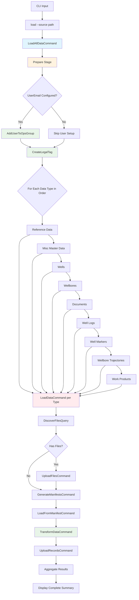
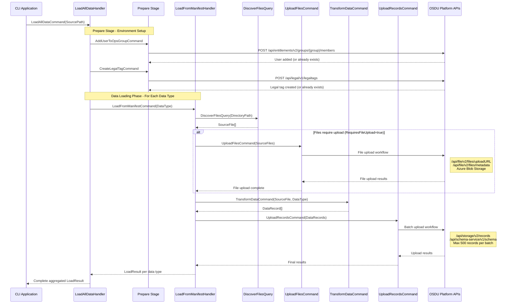
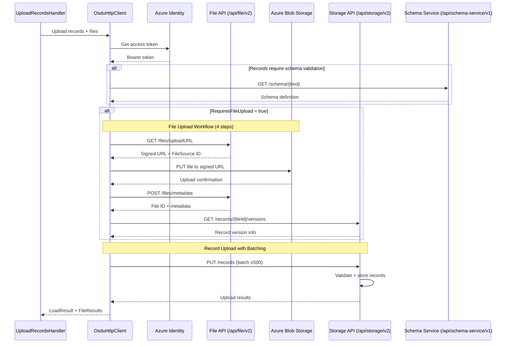

# Data Loading Process

This document explains the complete data loading process for the OSDU Data Load TNO application.

## Process Overview

The data loading process follows an orchestrated workflow that automatically loads all TNO data types in the correct dependency order. The process consists of 6 main steps:



## Data Loading Steps Explained

### Step 1: Download TNO Dataset Files
- Downloads official TNO test data from GitLab repository (~2.2GB)
- Extracts and organizes files into expected directory structure

### Step 2: Create Legal Tag
- Establishes required legal compliance tags for data governance
- Sets up legal framework required by OSDU platform
- **Handler**: `CreateLegalTagCommandHandler`

### Step 3: Upload Files to OSDU (4-step process)
- **Step 3a**: Request file upload URL from File API
- **Step 3b**: Upload file content to storage location
- **Step 3c**: Submit metadata to File Service
- **Step 3d**: Maintain registry of uploaded files with IDs and versions
- **Handler**: `UploadFilesCommandHandler`

### Step 4: Generate Non-Work Product Manifests
- Uses CSV templates to generate individual manifests for each data row
- Processes reference data, wells, wellbores, and related entities
- **Handler**: `GenerateManifestsCommandHandler`

### Step 5: Generate Work Product Manifests
- Iterates through uploaded files registry
- Retrieves JSON metadata from work product folders
- Updates manifests with legal tags, ACL permissions, and data partition IDs
- **Handler**: `GenerateWorkProductManifestCommandHandler`

### Step 6: Upload Manifests
- Submits all manifests to OSDU in correct dependency order:
  1. Reference Data (foundation lookup data)
  2. Misc Master Data (additional dependencies)
  3. Wells (well master data)
  4. Wellbores (depends on wells)
  5. Documents (document files)
  6. Well Logs (log files and data)
  7. Well Markers (geological markers)
  8. Wellbore Trajectories (directional surveys)
  9. Work Products (final metadata referencing uploaded files)
- Processes data types sequentially to maintain referential integrity
- **Handler**: `LoadFromManifestCommandHandler` → `UploadRecordsCommandHandler`
    style P fill:#fff3e0
    style P2 fill:#e8f5e8
    style P4 fill:#e8f5e8
    style F fill:#ffebee
    style J fill:#e8f5e8

## Detailed Process Flow

### Complete Command Orchestration Overview


## Prepare Stage Details

The prepare stage ensures that the OSDU environment is properly configured before data loading begins. This stage includes user authorization setup and legal tag creation.

### Legal Tag Creation

When `OSDU_LEGAL_TAG` is configured, the application will:

1. **Create Legal Tag**: Creates a legal tag with the specified name
2. **Default Properties**: Uses standard compliance settings:
   - Countries of Origin: [US, CA]
   - Contract ID: No Contract Related
   - Data Type: Public Domain Data
   - Export Classification: EAR99
   - Originator: TNO
   - Personal Data: No Personal Data

3. **Conflict Handling**: Gracefully handles 409 responses when legal tag already exists
4. **Validation**: Ensures legal tag is available for data record creation

**Configuration Example:**
```bash
export OSDU_LEGAL_TAG="tno-geological-data-public"
```

### 3. Upload Phase


## File Upload Process

The C# implementation includes a complete **4-step file upload workflow** that matches the Python `load_single_file()` function:

1. **Get Upload URL**: Request signed URL from OSDU File API (`/files/uploadURL`)
2. **Upload to Blob**: Upload file to Azure Blob Storage using signed URL
3. **Post Metadata**: Submit file metadata to OSDU (`/files/metadata`)
4. **Get Version**: Retrieve record version from Storage API (`/records/{fileId}/versions`)