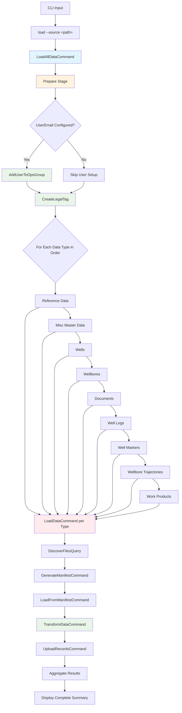
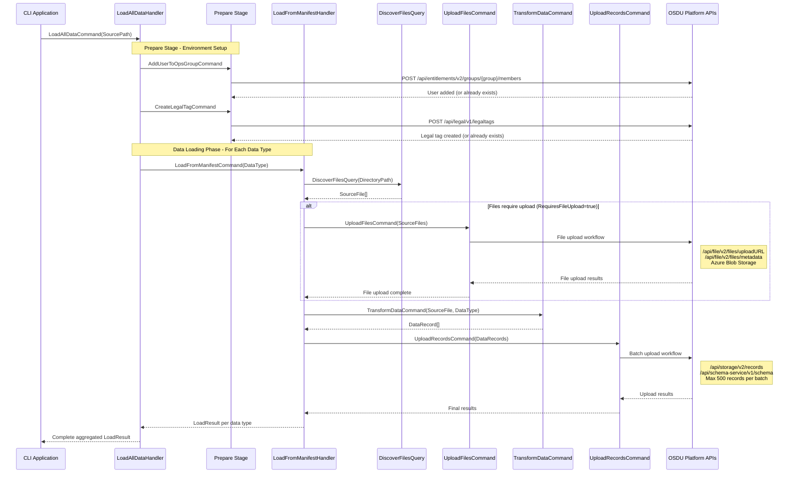
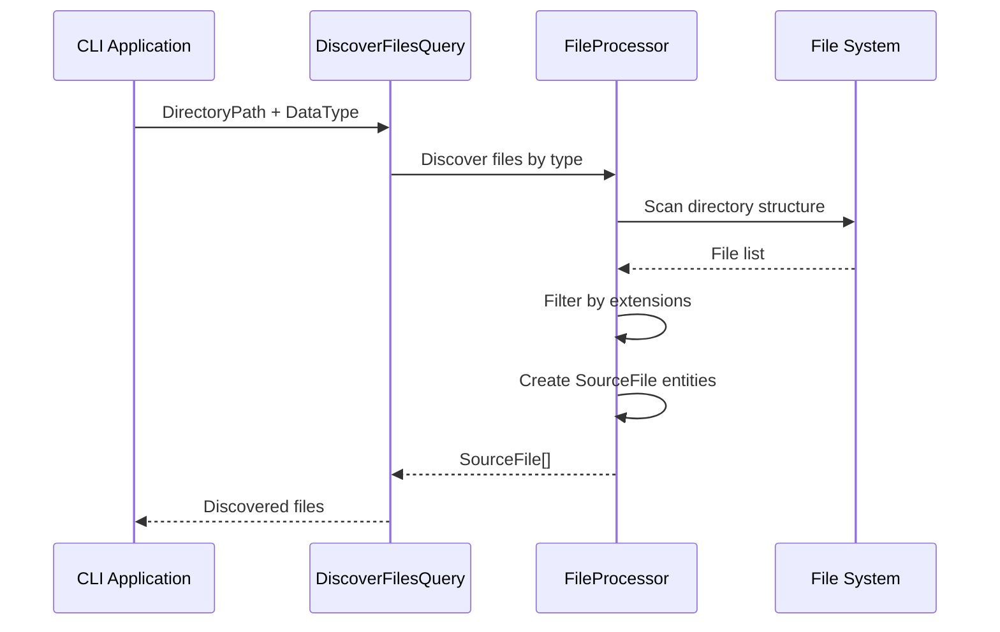
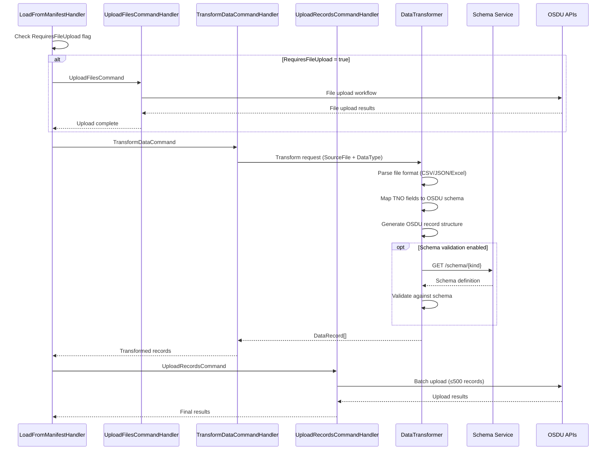
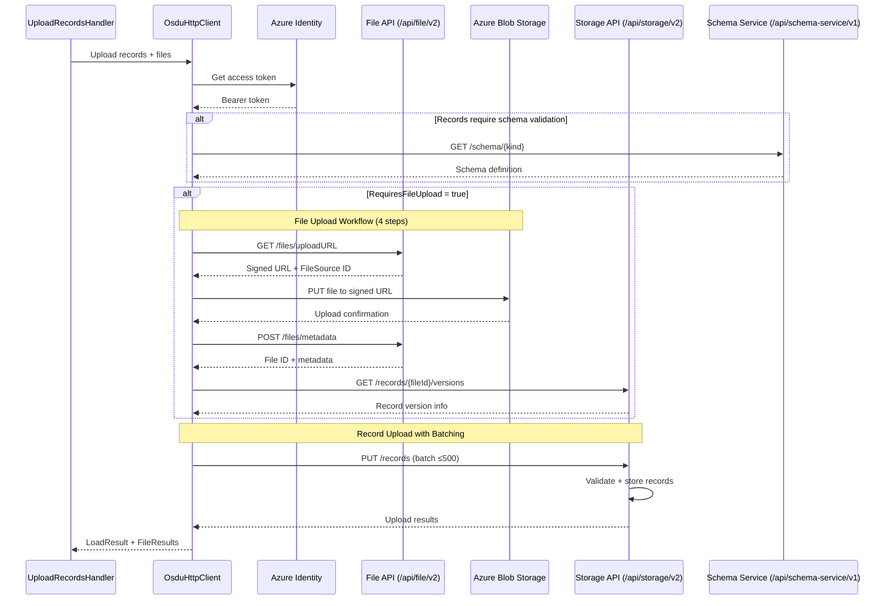
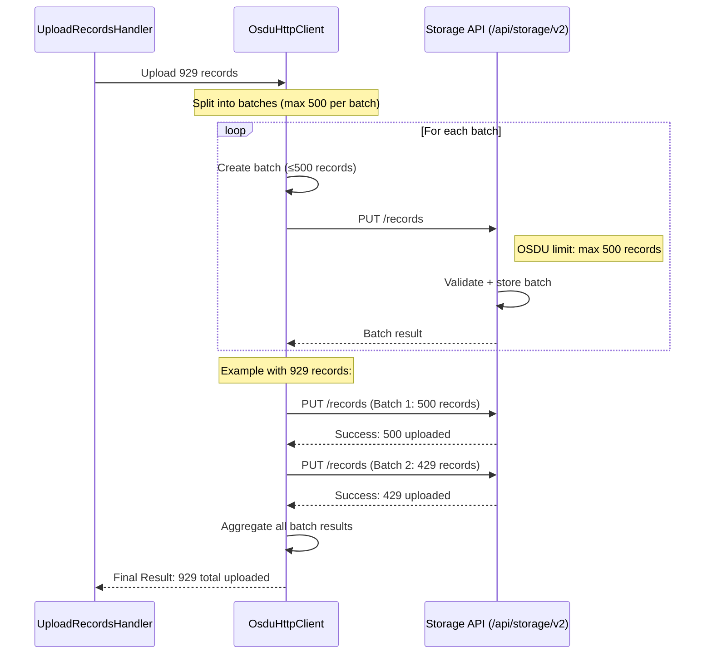

# Data Loading Process

This document explains the complete data loading process for the OSDU Data Load TNO application.

## Process Overview

The data loading process follows an orchestrated workflow that automatically loads all TNO data types in the correct dependency order:



## Orchestrated Loading Order

The solution automatically processes data in this order:

### 0. **Prepare Stage** → Environment setup and prerequisites
   - **User Authorization**: Adds configured user to `users.datalake.ops@{dataPartition}.dataservices.energy` group
   - **Legal Tag Creation**: Creates the specified legal tag with standard compliance properties
   
### 1. **Reference Data** → Foundation data required by all other types
2. **Misc Master Data** → Additional master data dependencies
3. **Wells** → Well master data
4. **Wellbores** → Wellbore master data (depends on wells)
5. **Documents** → Document files
6. **Well Logs** → Well log files
7. **Well Markers** → Marker data files
8. **Wellbore Trajectories** → Trajectory data files
9. **Work Products** → Final work product data

## Detailed Process Flow

### Complete Command Orchestration Overview


## Prepare Stage Details

The prepare stage ensures that the OSDU environment is properly configured before data loading begins. This stage includes user authorization setup and legal tag creation.

### User Authorization Setup

When `OSDU_USER_EMAIL` is configured, the application will:

1. **Check User Authorization**: Adds the specified user to the data partition operations group
2. **Group Pattern**: Uses the format `users.datalake.ops@{dataPartition}.dataservices.energy`
3. **Conflict Handling**: Gracefully handles 409 responses when user is already in the group
4. **Error Logging**: Provides detailed logging for authorization operations

**Configuration Example:**
```bash
export OSDU_USER_EMAIL="john.doe@example.com"
export OSDU_DATA_PARTITION="opendes"
```

This will add `john.doe@example.com` to the group `users.datalake.ops@opendes.dataservices.energy`.

### Legal Tag Creation

When `OSDU_LEGAL_TAG` is configured, the application will:

1. **Create Legal Tag**: Creates a legal tag with the specified name
2. **Default Properties**: Uses standard compliance settings:
   - Countries of Origin: [US, CA]
   - Contract ID: No Contract Related
   - Data Type: Public Domain Data
   - Export Classification: EAR99
   - Originator: TNO
   - Personal Data: No Personal Data

3. **Conflict Handling**: Gracefully handles 409 responses when legal tag already exists
4. **Validation**: Ensures legal tag is available for data record creation

**Configuration Example:**
```bash
export OSDU_LEGAL_TAG="tno-geological-data-public"
```

### Error Handling

The prepare stage implements robust error handling:

- **409 Conflicts**: Treated as success conditions (resource already exists)
- **API Failures**: Logged with detailed error information
- **Continuation**: Data loading continues even if prepare stage encounters non-critical errors
- **Validation**: Validates OSDU configuration before attempting operations

### 1. File Discovery Phase


### 2. Data Transformation Phase


### 3. Upload Phase


### 4. Intelligent Batching


## File Upload Process

The C# implementation includes a complete **4-step file upload workflow** that matches the Python `load_single_file()` function:

1. **Get Upload URL**: Request signed URL from OSDU File API (`/files/uploadURL`)
2. **Upload to Blob**: Upload file to Azure Blob Storage using signed URL
3. **Post Metadata**: Submit file metadata to OSDU (`/files/metadata`)
4. **Get Version**: Retrieve record version from Storage API (`/records/{fileId}/versions`)

This ensures **complete integration** with OSDU platform file management and work product relationships.

## Data Types and Processing

| Data Type | Description | File Formats | Upload Method |
|-----------|-------------|--------------|---------------|
| `Wells` | Well master data | CSV, JSON, Excel | Records API |
| `Wellbores` | Wellbore information | CSV, JSON, Excel | Records API |
| `WellboreTrajectories` | Directional survey data | CSV, JSON | Records + Files API |
| `WellMarkers` | Geological markers | CSV, JSON | Records + Files API |
| `WellboreMarkers` | Wellbore-specific markers | CSV, JSON | Records + Files API |
| `WellLogs` | Log curve data | LAS, DLIS, CSV | Files API (4-step workflow) |
| `Documents` | Document files | PDF, DOC, XLS, etc. | Files API (4-step workflow) |
| `ReferenceData` | Lookup tables | CSV, JSON | Records API |
| `Horizons` | Geological horizons | CSV, JSON | Records API |
| `Formations` | Formation tops | CSV, JSON | Records API |
| `WellCompletions` | Completion data | CSV, JSON | Records API |
| `WorkProducts` | Work product metadata | JSON manifests | Records API with file references |

## Expected Directory Structure

The application expects the following directory structure (matches the Python solution's open-test-data format):

```
C:\data\tno\
├── datasets/                        # File data (Phase 3)
│   ├── documents/                   # Document files
│   ├── markers/                     # Marker data files  
│   ├── trajectories/                # Trajectory data files
│   └── well-logs/                   # Well log files
├── manifests/                       # Generated manifest directories (Phases 1-2)
│   ├── reference-manifests/         # Reference data manifests
│   ├── misc-master-data-manifests/  # Misc master data manifests
│   ├── master-well-data-manifests/  # Well master data manifests
│   └── master-wellbore-data-manifests/ # Wellbore master data manifests
├── TNO/                            # TNO-specific data
│   ├── contrib/                     # TNO contributed data
│   └── provided/
│       └── TNO/
│           └── work-products/       # Work product data (Phase 4)
│               ├── markers/
│               ├── trajectories/
│               ├── well\ logs/      # Note: contains space
│               └── documents/
├── schema/                          # OSDU schema files
└── templates/                       # Data templates
```
