# Data Loading Process

This document explains the complete data loading process for the OSDU Data Load TNO application.

## Process Overview

The data loading process follows an orchestrated workflow that automatically loads all TNO data types in the correct dependency order. The process consists of 6 main steps:

### Step 1: Download TNO Dataset Files
- Downloads official TNO test data from GitLab repository (~2.2GB)
- Extracts and organizes files into expected directory structure

### Step 2: Create Legal Tag
- Establishes required legal compliance tags for data governance
- Sets up legal framework required by OSDU platform

### Step 3: Upload Files to OSDU (4-step process)
- **Step 3a**: Request file upload URL from File API
- **Step 3b**: Upload file content to storage location
- **Step 3c**: Submit metadata to File Service
- **Step 3d**: Maintain registry of uploaded files with IDs and versions

### Step 4: Generate Non-Work Product Manifests
- **Note**: The manifest generation is extremely complex - it was so complex that porting it to C# proved infeasible. Instead, the original [python scripts](../src/generate-manifest-scripts) are used but updated to upload the ACL, legal tag and data partition.
- Uses CSV templates to generate individual manifests for each data row
- Processes reference data, wells, wellbores, and related entities

### Step 5: Generate Work Product Manifests
- Iterates through uploaded files registry
- Retrieves JSON metadata from work product folders
- Updates manifests with legal tags, ACL permissions, and data partition IDs

### Step 6: Upload Manifests
- Submits all manifests to OSDU in correct dependency order:
  1. Reference Data (foundation lookup data)
  2. Misc Master Data (additional dependencies)
  3. Wells (well master data)
  4. Wellbores (depends on wells)
  5. Documents (document files)
  6. Well Logs (log files and data)
  7. Well Markers (geological markers)
  8. Wellbore Trajectories (directional surveys)
  9. Work Products (final metadata referencing uploaded files)

## Detailed Process Flow

### Complete Command Orchestration Overview

```mermaid
sequenceDiagram
    participant CLI as CLI Application
    participant Download as DownloadDataHandler
    participant LoadAll as LoadAllDataHandler
    participant Prepare as Prepare Stage
    participant Upload as UploadFilesHandler
    participant Generate as GenerateManifestsHandler
    participant Workflow as SubmitManifestsHandler
    participant OSDU as OSDU Platform APIs

    Note over CLI: Download Data Stage
    CLI->>Download: DownloadDataCommand(DestinationPath)
    Download->>Download: Download ZIP from GitLab
    Download->>Download: Extract to temp directory
    Download->>Download: Organize files to expected structure
    Download-->>CLI: Download complete
    
    Note over CLI: Prepare Stage - Environment Setup
    CLI->>LoadAll: LoadAllDataCommand(SourcePath)
    LoadAll->>Prepare: CreateLegalTagCommand
    Prepare->>OSDU: POST /api/legal/v1/legaltags
    OSDU-->>Prepare: Legal tag created (or already exists)
    
    Note over CLI: Data Upload Stage - File Upload Workflow
    LoadAll->>Upload: UploadFilesCommand(SourceFiles)
    
    loop For each file requiring upload
        Upload->>OSDU: GET /api/file/v2/files/uploadURL
        OSDU-->>Upload: Signed URL + FileSource ID
        Upload->>OSDU: PUT file to Azure Blob Storage
        OSDU-->>Upload: Upload confirmation
        Upload->>OSDU: POST /api/file/v2/files/metadata
        OSDU-->>Upload: File ID + metadata
        Upload->>OSDU: GET /api/storage/v2/records/{fileId}/versions
        OSDU-->>Upload: Record version info
    end
    
    Upload-->>LoadAll: File upload registry complete
    
    Note over CLI: Manifest Generation Stage
    LoadAll->>Generate: GenerateManifestsCommand
    
    Note over Generate: Non-Work Product Flow
    Generate->>Generate: Process CSV templates for reference data
    Generate->>Generate: Generate manifests for wells, wellbores using [csv_to_json_wrapper.py](../src/generate-manifest-scripts/csv_to_json_wrapper.py)
    
    Note over Generate: Work Product Flow  
    Generate->>Generate: Process work product JSON templates
    Generate->>Generate: Update with uploaded file references
    Generate->>Generate: Apply legal tags, ACL, data partition
    
    Generate-->>LoadAll: All manifests generated
    
    Note over CLI: Manifest Upload Stage
    LoadAll->>Workflow: SubmitManifestsToWorkflowServiceCommand
    
    loop For each data type in dependency order
        Workflow->>OSDU: PUT /api/storage/v2/records (batch ≤500)
        Note right of OSDU: 1. Reference Data<br/>2. Misc Master Data<br/>3. Wells<br/>4. Wellbores<br/>5. Documents<br/>6. Well Logs<br/>7. Well Markers<br/>8. Wellbore Trajectories<br/>9. Work Products
        OSDU-->>Workflow: Upload results per batch
    end
    
    Workflow-->>LoadAll: All manifests uploaded
    LoadAll-->>CLI: Complete load results
```
