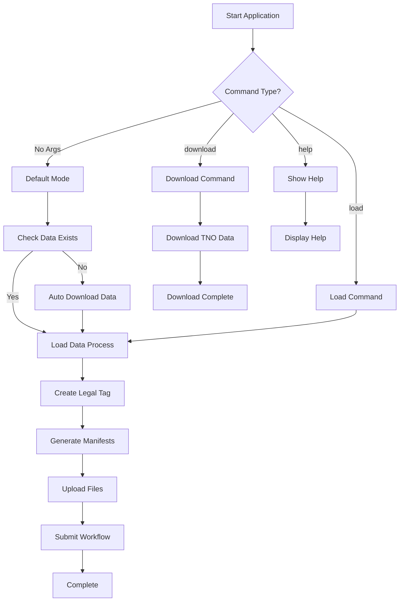

# OSDU Data Load TNO

A .NET 9.0 console application for loading TNO (Netherlands Organisation for Applied Scientific Research) test data into the OSDU (Open Subsurface Data Universe) platform. This application provides a streamlined workflow for data ingestion, manifest generation, and file upload to OSDU energy data platforms.

## 🏗️ Architecture Overview

The application follows Clean Architecture principles with clear separation of concerns:

```
┌─────────────────────────────────────────────────────────────┐
│                    OSDU.DataLoad.Console                    │
│           (Entry Point & User Interface Layer)             │
├─────────────────────────────────────────────────────────────┤
│                 OSDU.DataLoad.Application                   │
│              (Commands, Handlers & Services)               │
├─────────────────────────────────────────────────────────────┤
│                OSDU.DataLoad.Infrastructure                 │
│           (External Services & Implementations)            │
├─────────────────────────────────────────────────────────────┤
│                   OSDU.DataLoad.Domain                      │
│                (Entities & Interfaces)                     │
└─────────────────────────────────────────────────────────────┘
```

### Key Components

- **Console Layer**: Command-line interface and application entry point
- **Application Layer**: MediatR commands/queries and business logic orchestration
- **Infrastructure Layer**: External service integrations (OSDU API, file system, Azure services)
- **Domain Layer**: Core entities, interfaces, and business rules

## 🔄 Application Flow

### High-Level Process



### Detailed Data Load Process

The core data loading process consists of 4 main steps:

#### Step 1: Legal Tag Creation
```
CreateLegalTagCommand → CreateLegalTagCommandHandler
├── Validates legal tag configuration
├── Creates legal tag in OSDU platform via IOsduService
└── Returns success/failure status
```

#### Step 2: Manifest Generation
```
GenerateManifestsCommand → GenerateManifestsCommandHandler
├── Orchestrates both work product and non-work product manifests
├── GenerateWorkProductManifestCommand
│   └── Processes work product data and creates JSON manifests
├── GenerateNonWorkProductManifestCommand
│   └── Processes reference data and creates JSON manifests
└── Uses Python scripts for CSV to JSON conversion
```

#### Step 3: File Upload
```
UploadFilesCommand → UploadFilesCommandHandler
├── Discovers files in datasets/ directory
├── Validates file types and sizes
├── Uploads files to OSDU platform via IOsduService
└── Tracks upload success/failure rates
```

#### Step 4: Workflow Submission
```
SubmitWorkflowCommand → SubmitWorkflowCommandHandler
├── Creates workflow execution context
├── Submits workflow to OSDU platform
└── Returns workflow execution status
```

## 🚀 Usage

### Command Line Options

#### Default Behavior (No Arguments)
```bash
dotnet run
```
- Checks for TNO data in `~/osdu-data/tno`
- Downloads data automatically if not present
- Loads all data types into OSDU platform

#### Load Command
```bash
dotnet run load --source <path>
```
- Loads TNO data from specified directory
- Runs the complete 4-step process

#### Download Command
```bash
dotnet run download --destination <path> [--overwrite]
```
- Downloads TNO test data to specified location
- Optional `--overwrite` flag to replace existing data

#### Help Command
```bash
dotnet run help
```
- Displays usage information and examples

### Environment Configuration

Configure OSDU connection settings using environment variables:

```bash
# Required OSDU Platform Settings
export OSDU_BaseUrl="https://your-osdu-instance.com"
export OSDU_TenantId="your-tenant-id"
export OSDU_ClientId="your-client-id"
export OSDU_DataPartition="your-data-partition"

# Data Classification Settings
export OSDU_LegalTag="your-legal-tag"
export OSDU_AclViewer="data.default.viewers@yourcompany.com"
export OSDU_AclOwner="data.default.owners@yourcompany.com"

# Optional: User Management
export OSDU_UserEmail="user@yourcompany.com"
```

## 📁 Data Structure

The application expects TNO data in the following structure:

```
osdu-data/tno/
├── datasets/                    # Raw data files for upload
│   ├── documents/
│   ├── well-logs/
│   ├── markers/
│   └── trajectories/
├── manifests/                   # Generated JSON manifests
│   ├── work-product-manifests/
│   └── non-work-product-manifests/
├── TNO/                        # Source TNO data
│   └── provided/
│       └── TNO/
│           └── work-products/
└── output/                     # Processing outputs
```

## 🐳 Container Deployment

The application is optimized for container environments:

### Key Container Features
- **Structured Logging**: All output uses `ILogger` for proper log aggregation
- **Graceful Exit**: Returns appropriate exit codes for orchestrator management
- **Environment-Based Configuration**: Uses environment variables instead of config files
- **No Interactive Prompts**: Fully automated execution suitable for batch processing

### Docker Example
```dockerfile
FROM mcr.microsoft.com/dotnet/runtime:9.0
WORKDIR /app
COPY bin/Release/net9.0/publish/ .
ENTRYPOINT ["dotnet", "OSDU.DataLoad.Console.dll"]
```

### Kubernetes Job Example
```yaml
apiVersion: batch/v1
kind: Job
metadata:
  name: osdu-data-load
spec:
  template:
    spec:
      containers:
      - name: data-loader
        image: osdu-data-load:latest
        env:
        - name: OSDU_BaseUrl
          value: "https://osdu.yourcompany.com"
        - name: OSDU_DataPartition
          value: "opendes"
        # ... other environment variables
      restartPolicy: OnFailure
```

## 🔧 Development

### Prerequisites
- .NET 9.0 SDK
- Python 3.x (for manifest generation scripts)
- Access to an OSDU platform instance

### Building
```bash
dotnet restore
dotnet build
```

### Testing
```bash
dotnet test
```

### Project Structure
```
src/
├── OSDU.DataLoad.Console/          # Entry point and CLI
├── OSDU.DataLoad.Application/      # Commands and handlers
├── OSDU.DataLoad.Infrastructure/   # External service implementations
├── OSDU.DataLoad.Domain/          # Core entities and interfaces
└── OSDU.DataLoad.sln              # Solution file
```

## 📊 Monitoring and Logging

The application provides comprehensive logging for operational monitoring:

### Log Levels
- **Information**: Normal operations, progress updates, configuration status
- **Warning**: Non-critical issues (missing config, skipped operations)
- **Error**: Operation failures that don't stop execution
- **Critical**: Fatal errors preventing startup

### Structured Logging Examples
```
[Information] Starting OSDU Data Load TNO - Load Command (Source: "/data/tno")
[Information] Step 1: Creating legal tag
[Information] Legal Tag Creation: Success
[Information] Step 2: Generating manifests
[Information] Processed: 150, Successful: 148, Failed: 2
[Information] Overall Result: Success, Total Duration: 02:34
```

## 🔍 Troubleshooting

### Common Issues

1. **Authentication Failures**
   - Verify OSDU_TenantId and OSDU_ClientId are correct
   - Ensure proper permissions in OSDU platform

2. **File Upload Errors**
   - Check file sizes (large files may timeout)
   - Verify network connectivity to OSDU platform

3. **Manifest Generation Failures**
   - Ensure Python scripts are available in generate-manifest-scripts/
   - Check CSV data format and headers

4. **Configuration Issues**
   - Use `dotnet run help` to verify configuration status
   - Check environment variable formatting

### Exit Codes
- `0`: Success
- `-1`: Invalid arguments or operation failure
- `1`: Fatal application error
- `99`: Unexpected error

## 📄 License

This project is part of the OSDU ecosystem and follows the applicable licensing terms for OSDU implementations.

## 🤝 Contributing

1. Follow Clean Architecture principles
2. Use structured logging with appropriate log levels
3. Ensure container compatibility
4. Add comprehensive error handling
5. Update this README for significant changes

## 📞 Support

For issues related to:
- **OSDU Platform**: Contact your OSDU platform administrator
- **TNO Data**: Refer to TNO documentation and data specifications  
- **Application Issues**: Check logs and troubleshooting section above
